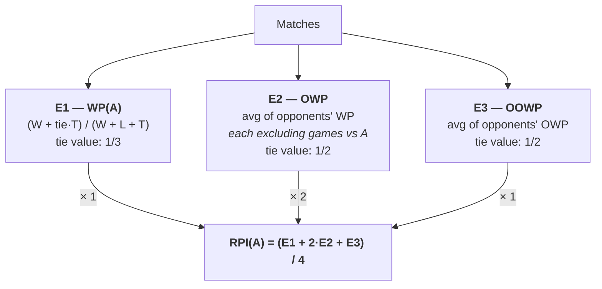
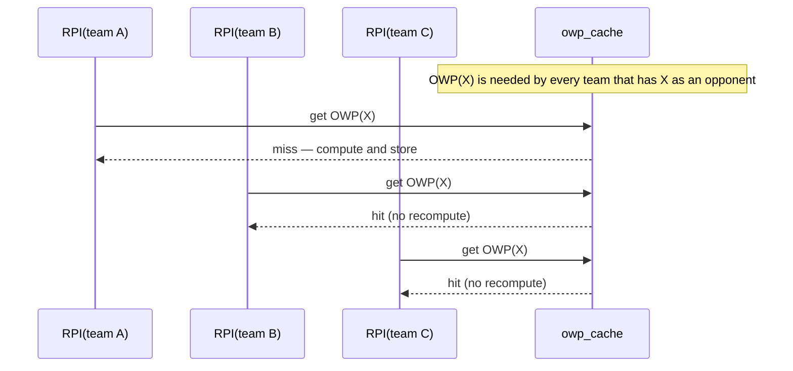

# jk-soccer-core

The core soccer module for jedi-knights — match models, percentage calculators, and a full NCAA RPI implementation.

[](https://github.com/jedi-knights/jk-soccer-core/actions/workflows/ci.yml)
[](https://github.com/jedi-knights/jk-soccer-core/actions/workflows/release.yml)
[](https://github.com/jedi-knights/jk-soccer-core/actions/workflows/publish.yml)
[](https://www.python.org/)
[](LICENSE)

## Table of Contents

- [Overview](#overview)
- [Features](#features)
- [Requirements](#requirements)
- [Installation](#installation)
- [Usage](#usage)
- [RPI](#rpi)
- [Configuration](#configuration)
- [Development](#development)
- [Contributing](#contributing)
- [License](#license)
- [References](#references)

## Overview

`jk-soccer-core` is a pure-Python library for working with soccer match data: domain models (`Match`, `Team`, `Player`, `Coach`), simple counting calculators (wins, losses, draws, points, meetings), and a full implementation of the NCAA Division I Rating Percentage Index (RPI) including the 2024+ women's soccer specification.

Calculators are exposed as plain classes that conform to a `MatchCalculation[T]` `Protocol`, so callers can compose them via dependency injection without any inheritance. The RPI pipeline supports per-team queries and a batch ranking API that computes every team's RPI in a single pass with shared intermediates.

## Features

- **Match domain models** — `Match`, `Team`, `Player`, `Coach` as plain dataclasses
- **Counting calculators** — `WinsCalculation`, `LossesCalculation`, `DrawsCalculation`, `PointsCalculation`, `MeetingsCalculation`
- **Percentage calculators** — `WinningPercentageCalculation`, `OpponentsWinningPercentageCalculation`, `OpponentsOpponentsWinningPercentageCalculation`
- **Full NCAA RPI** — `RPICalculation` with per-team `calculate()` and league-wide `calculate_for_all()`; defaults match the post-2024 NCAA D1 women's soccer specification
- **`MatchCalculation[T]` Protocol** — structural type for DI; concrete classes don't inherit, they conform
- **Configurable tie values and weights** — supports the 2024+ formula (E1 ties = 1/3), the pre-2024 formula (E1 ties = 1/2), and arbitrary 3-tuple weight overrides
- **Penalty-shootout aware** — shootout matches are counted as draws, matching NCAA scoring conventions
- **Full-precision intermediates** — WP, OWP, and OOWP are computed at full precision and rounded only at the boundary

## Requirements

- Python **3.13** or newer
- [`uv`](https://github.com/astral-sh/uv) (recommended) or `pip`

## Installation

From PyPI:

```bash
pip install jk-soccer-core
```

Or with `uv`:

```bash
uv add jk-soccer-core
```

## Usage

### Define matches

```python
from jk_soccer_core import Match

matches = [
    Match("Team A", "Team B", 1, 0),
    Match("Team A", "Team C", 1, 1),
    Match("Team A", "Team D", 0, 1),
    Match("Team B", "Team C", 1, 0),
    Match("Team B", "Team D", 0, 1),
    Match("Team C", "Team D", 1, 1),
]
```

### Compute RPI for a single team

```python
from jk_soccer_core.calculations import RPICalculation

result = RPICalculation("Team A", number_of_digits=4).calculate(matches)
print(f"WP={result.wp} OWP={result.owp} OOWP={result.oowp} RPI={result.rpi}")
```

### Rank an entire league in one call

```python
from jk_soccer_core.calculations import RPICalculation

ranked = RPICalculation.calculate_for_all(matches, number_of_digits=4)
for team, b in sorted(ranked.items(), key=lambda kv: kv[1].rpi, reverse=True):
    print(f"{team}: RPI={b.rpi:.4f}  (WP={b.wp}, OWP={b.owp}, OOWP={b.oowp})")
```

### Use the Protocol for dependency injection

```python
from collections.abc import Iterable
from jk_soccer_core import Match
from jk_soccer_core.calculations import MatchCalculation

def report(name: str, calc: MatchCalculation[float], matches: Iterable[Match]) -> str:
    return f"{name}: {calc.calculate(matches):.4f}"
```

Any object with a `calculate(matches) -> T` method satisfies `MatchCalculation[T]` — concrete classes do not declare conformance.

## RPI

The Rating Percentage Index combines three elements (E1, E2, E3) with a 1:2:1 weighting. By default this library uses the post-2024 NCAA Division I women's soccer specification: ties contribute `1/3` to the team's own winning percentage (E1) and `1/2` to opponent records (E2, E3).



The "*excluding games vs A*" rule on E2 is the part that's hard to convey in prose: when computing opponent X's contribution to A's OWP, the games X played against A are removed from X's record. E3 applies the same averaging recursively over each opponent's OWP.

For the pre-2024 formula, pass `e1_tie_value=0.5` explicitly.

### Batch ranking

`RPICalculation.calculate_for_all(matches)` builds the team index once and memoizes each team's OWP across the full league. Because every opponent's OWP is independent of which team is asking for it, the cache pays off after the first lookup:



Each unique opponent's OWP is computed exactly once per `calculate_for_all` call regardless of how many teams reference it.

## Configuration

`RPICalculation` accepts these keyword arguments (the same set is available on `calculate_for_all`):

| Argument | Default | Description |
|---|---|---|
| `number_of_digits` | `2` | Rounding precision applied at the `RPIBreakdown` boundary only |
| `weights` | `(1.0, 2.0, 1.0)` | Tuple of `(w1, w2, w3)` applied to (E1, E2, E3); divisor is the sum |
| `e1_tie_value` | `1/3` | Tie weight for Element 1 (own WP). NCAA 2024+ default; pass `0.5` for pre-2024 |
| `e2_e3_tie_value` | `0.5` | Tie weight for Element 2 and Element 3 — unchanged in 2024 |

`WinningPercentageCalculation`, `OpponentsWinningPercentageCalculation`, and `OpponentsOpponentsWinningPercentageCalculation` accept their own `tie_value` and `number_of_digits` for direct use outside the RPI pipeline.

## Development

```bash
# Clone and install (with dev extras)
git clone https://github.com/jedi-knights/jk-soccer-core
cd jk-soccer-core
uv sync --all-extras --dev
```

The default invoke task runs the full CI suite (mypy → ruff → pytest with 100% coverage required):

```bash
uv run inv             # default: lint + test
uv run inv lint        # mypy + ruff
uv run inv test        # pytest with coverage
uv run inv fmt         # ruff format
uv run inv build       # uv build
```

CI runs the same chain via `.github/workflows/ci.yml` — every PR runs `commitlint`, then `lint` and `test` in parallel.

Commit messages follow [Conventional Commits](https://www.conventionalcommits.org/) and are validated by [`python-commitlint`](https://github.com/jedi-knights/python-commitlint).

## Contributing

- Open issues and pull requests at [github.com/jedi-knights/jk-soccer-core](https://github.com/jedi-knights/jk-soccer-core)
- Use Conventional Commits for all commit messages — CI rejects non-conforming commits
- Keep test coverage at 100% — the `test` task fails below that threshold
- Run `uv run inv` locally before opening a PR

## License

MIT — see [LICENSE](LICENSE).

## References

- [NCAA RPI for Division I Women's Soccer](https://sites.google.com/site/rpifordivisioniwomenssoccer/Home) — methodology source
- [Marimo](https://docs.marimo.io/) — used for exploration notebooks
